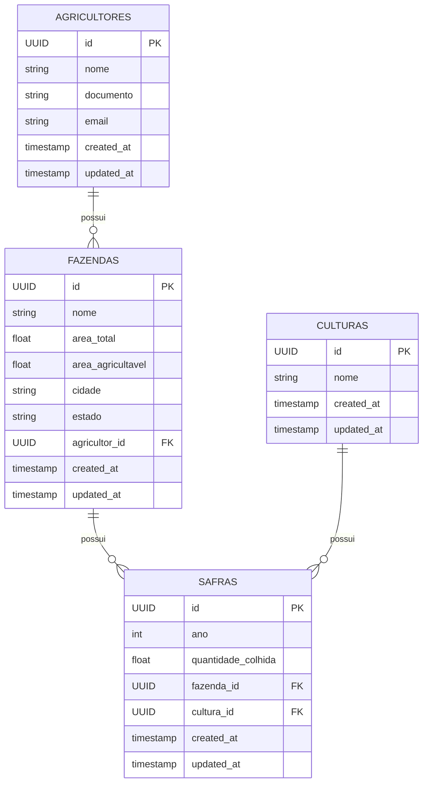

# 🌾 Brain Agriculture API

API REST para gestão de Agricultores, Fazendas, Culturas e Safras. Projeto desenvolvido em NestJS com TypeScript seguindo princípios de Clean Architecture.

---

## 🚀 Tecnologias

- [NestJS](https://nestjs.com/)
- [TypeORM](https://typeorm.io/)
- [PostgreSQL](https://www.postgresql.org/)
- [Docker](https://www.docker.com/)
- [Swagger](https://swagger.io/)

---

## 🐳 Como executar com Docker

### 1. Copie o arquivo de variáveis

```bash
cp .env.example .env
```

### 2. Suba os containers

```bash
docker-compose up --build
```

> A aplicação NestJS será iniciada em `http://localhost:3000`  
> O banco PostgreSQL estará acessível na porta `5432`

---

## 🧪 Scripts úteis

### Rodar a aplicação localmente (sem Docker)

```bash
npm install
npm run start:dev
```

### Rodar os testes

```bash
npm run test
```

### Executar migrations

```bash
npm run migration:run
```

---

## 📚 Documentação Swagger

Após subir o projeto, acesse a documentação Swagger em:

👉 [`http://localhost:3000/api`](http://localhost:3000/api)

---

## 📁 Estrutura de Pastas (Clean Architecture)

```
src
├── application
│   ├── dtos
│   └── use-cases
├── domain
│   ├── entities
│   └── repositories
├── infrastructure
│   ├── repositories
│   └── typeorm
│   │   └── config
│   │   └── mappers
│   │   └── models
│   │   └── seed
├── presentation
│   ├── controllers
├── shared
│   ├── config
│   │   └── environment-variable
│   └── utils
│   │   └── initializers
└── main.ts
```

---

## ✅ Endpoints Disponíveis

### 🌾 Agricultores

| Método | Rota              | Descrição                          |
| ------ | ----------------- | ---------------------------------- |
| POST   | /agricultores     | Cadastra novo agricultor           |
| GET    | /agricultores     | Lista todos os agricultores        |
| PUT    | /agricultores/:id | Atualiza os dados de um agricultor |
| DELETE | /agricultores/:id | Remove um agricultor               |

---

### 🏡 Fazendas

| Método | Rota          | Descrição                        |
| ------ | ------------- | -------------------------------- |
| POST   | /fazendas     | Cadastra nova fazenda            |
| GET    | /fazendas     | Lista todas as fazendas          |
| PUT    | /fazendas/:id | Atualiza os dados de uma fazenda |
| DELETE | /fazendas/:id | Remove uma fazenda               |

---

### 🌱 Culturas

| Método | Rota          | Descrição                        |
| ------ | ------------- | -------------------------------- |
| POST   | /culturas     | Cadastra nova cultura            |
| GET    | /culturas     | Lista todas as culturas          |
| PUT    | /culturas/:id | Atualiza os dados de uma cultura |
| DELETE | /culturas/:id | Remove uma cultura               |

---

### 🌾 Safras

| Método | Rota        | Descrição                      |
| ------ | ----------- | ------------------------------ |
| POST   | /safras     | Cadastra nova safra            |
| GET    | /safras     | Lista todas as safras          |
| PUT    | /safras/:id | Atualiza os dados de uma safra |
| DELETE | /safras/:id | Remove uma safra               |

---

## 🧱 Diagrama do Banco de Dados


